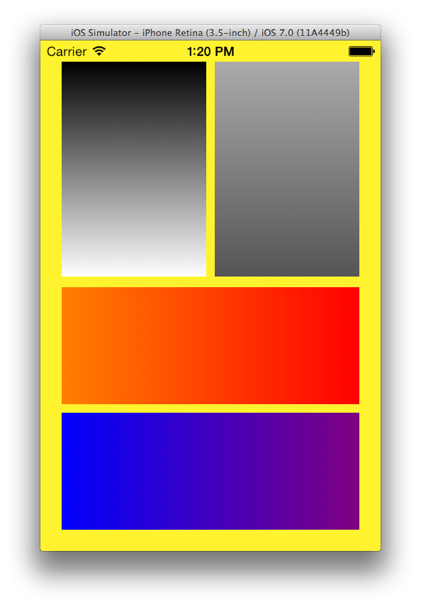

GRKGradientView
===========
A UIView subclass which draws a configurable gradient.

#### Future Ideas

* Radial gradient.
* Linear gradient with an angle.
* Animatable rotation of linear gradient.
* Linear gradient animates based on accelerometer data (gravity "down" is always the "end"
of the gradient).

### Installing

If you're using [CocoPods](http://cocopods.org) it's as simple as adding this to your `Podfile`:

	pod 'GRKGradientView', '~> 1.0'

### Documentation

Use as you would any other UIView, and simply configure appropriate to your needs.
In the simplest case, all you need supply are two colors for the start and end of the
gradient.

	@property (nonatomic,weak) IBOutlet GRKGradientView *downGradient;
	@property (nonatomic,weak) IBOutlet GRKGradientView *upGradient;

	- (void)viewDidLoad
	{
		[super viewDidLoad];
	
		self.downGradient.gradientColors = [NSArray arrayWithObjects:[UIColor lightGrayColor], [UIColor darkGrayColor], nil];

		self.upGradient.gradientOrientation = GRKGradientOrientationUp;
		self.upGradient.gradientColors = [NSArray arrayWithObjects:[UIColor whiteColor], [UIColor blackColor], nil];
	}

Additional documentation is available in `GRKGradientView.h`.

#### Disclaimer and Licence

* This work makes use of some techniques and concepts presented in [SAMGradientView](https://github.com/soffes/SAMGradientView)
* This work is licensed under the [Creative Commons Attribution 3.0 Unported License](http://creativecommons.org/licenses/by/3.0/).
  Please see the included LICENSE.txt for complete details.

#### About
A professional iOS engineer by day, my name is Levi Brown. Authoring a technical blog
[grokin.gs](http://grokin.gs), I am reachable via:

Twitter [@levigroker](https://twitter.com/levigroker)  
App.net [@levigroker](https://alpha.app.net/levigroker)  
Email [levigroker@gmail.com](mailto:levigroker@gmail.com)  

Your constructive comments and feedback are always welcome.
